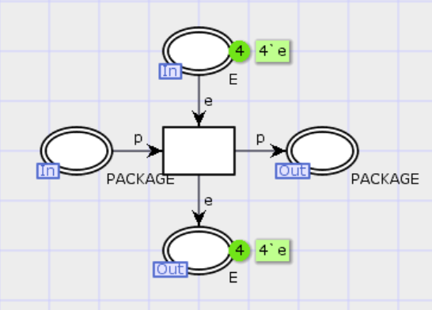
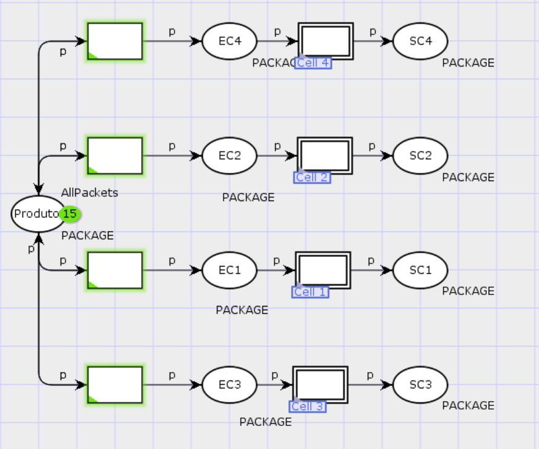

 # Modelagem de um Sistema de Manufatura

## Introdução

As **Redes de Petri** são uma poderosa ferramenta matemática e gráfica para modelar, analisar e simular sistemas dinâmicos a eventos discretos. Elas foram introduzidas por Carl Adam Petri em 1962 e são amplamente utilizadas para a maodelagem de fluxos de trabalho, redes de computadores, sistemas distribuídos, entre outras aplicações.

A estrutura de uma Rede de Petri consiste em quatro elementos principais:
- Places: Podem representar estados, consições ou recursos no sistema;
- Transitions: Representam os eventos ou mudanças de estado;
- Arches: Conectam os *places* e as *transitions*, indicando o fluxo entre eles;
- Tokens: Representam a distribuição de recursos ou o estado atual do sistema.
  
Uma extensão daquelas é a classe de Redes de Petri Coloridas (CPN), que introduzem o conceito de cor. Com isso, cada *token* pode ser diferenciado por atributos, permitindo representar informações adicionais sobre o sistema. As CPNs permitem modelar sistemas mais complexos sem aumentar significativamente a quantidade de lugares e transições no sistema, ideias para lidar com sistemas que apresetnam múltiplos tipos de objetos ou recursos, e possuem uma base matemática formal sólida que permite realizar análises rigorosas, comoa  identificação de gargalos ou comportamentos indesejados.

Este projeto propõe utilizar esses modelos a partir da ferramenta gráfica **CPN Tools**  para modelar um sistema de manufatura composto por células de manufatura como as ilustradas na figura 1:

<div style="text-align: center;">
    
    <p><strong>Figura 1:</strong> Célula de Manufatura.</p>
</div>

Cada célula apresenta duas rotas para os recursos: i e j. Ambas as rotas passam pelo robô 1, máquina 1 e robô 2. Nesse momento, as rotas se dividem para as máquinas 2 e 3, passam pelo robô 3 e seguem para a saída da célula. O sistema apresenta uma capacidade máxima, de modo que os depósios de entrada e saída das máquinas suportam no máximo 4 itens(*tokens*), e não deve apresentar bloqueios.


## Vídeo Explicativo

Aqui segue o link para um vídeo no youtube contendo uma breve explicação do sistema:
[\[CPN - Projeto SED\](https://youtu.be/uXaDAl3lCRE)](https://youtu.be/MWK04njh60E)

## Materiais e Método

Para a modelagem e análise gráfica do sitema de manufatura, foi utilizado o software [CPN Tools](http://cpntools.org), desenvolvido pela universidade de Aarhus, Dinamarca, e está disponível gratuitamente para usos não comerciais.
Esse software fornece ferramentas gráficas e em linguagem *Standard ML* para simulação de CPNs de forma intuitiva e completa.

### Célula

A priori, cada elemento do sistema foi desenhado no software como lugar ou transição. Os depósitos de entrada e saída, tanto das máquinas como das células são lugares de uma CPN. As transições representam a movimentação dos robôs que transportam a carga de um lugar a outro e o processo realizado pelas máquinas, que não é analisado no escopo do projeto, e é abstraído, bastando apenas o conhecimento de que as máquinas 2 e 3 recebem tipos diferentes de recurso.
O esquema de uma célula de manufatura é apresentado na figura 2.

<div style="text-align: center;">
    
    <p><strong>Figura 2:</strong> Esquema de uma Célula de Manufatura.<br>Fonte: O próprio autor</p>
</div>


As cores de uma CPN são determinados no software pela declaração de *colorsets*, uma definição de tipo de dado, que especifica características dos *tokens*. O tipo de dado(cor) transmitido na célula é definido como PACKAGE, um *colorset* composto por um *colorset* inteiro, que serve apenas para identificação do recurso, e outro **ROUTE** do tipo **i** ou **j**, que determina a rota que o recurso deve seguir. Eles são declarados da seguinte maneira:

```sml
colset ROUTE = with i | j;
colset PACKAGE = record route: ROUTE * id: INT;
```
Para controlar a quantidade de tokens em um lugar na CPN, é necessária a utilziação de um *anti-place*, declarado como tipo **E**, que fisicamente não faz parte do sistema, mas como o CPN Tools não oferece um método para lidar diretamente com limites de tokens, é necessário essa aplicação, onde para cada lugar da rede, existe um *anti-place* que controla a quantidade de *tokens* máximos no lugar correspondente.

A posteriori, é implementado um sistema de hierarquias, onde cada transição presente na estrutura das células é substituído por uma sub rede. Nesse projeto, foram implementados três tipos de subredes:

### Máquina

A transição que representa o processo realizado pela máuina é contruído seguindo a estrutura da figura 3:

<div style="text-align: center;">
    
    <p><strong>Figura 3:</strong> Esquema de Máquina.<br>Fonte: O próprio autor</p>
</div>

Nesse modelo, nota-se que a máquina transmite um *token* de um place a outro, e atualiza os contadores ou *anti-places*.

### Robô inicial

O robô inicial (Entrada da Célula -> Entrada da Máquina 1) é represetnado pelo modelo na figura 4:

<div style="text-align: center;">
    
    <p><strong>Figura 4:</strong> Esquema do Robô Inicial.<br>Fonte: O próprio autor</p>
</div>

Nesse modelo de robô, ele retira o token do place de entrada da célula e o transmite para o place de entrada da máquina 1, e atualiza o place referente a esse place. Note que como a entrada da célula não possui limite de itens, não há outro *anti-place* associado a essa transição. Caso seja implementado um robô intermediário entre duas máquinas, será necessário criar outra subrede apropriada para esse robô, semelhante ao robô inicial ilustrado, mas associado a mais um *anti-place*, referente à entrada da máquina anterior à transição.

### Robô Divisor

O modelo do robô divisor é representado pela rede ilustrada na figura 5:

<div style="text-align: center;">
    
    <p><strong>Figura 5:</strong> Esquema do Robô Divisor.<br>Fonte: O próprio autor</p>
</div>

Esse robô é responsável por separar itens entre duas rotas, ele transfere os *tokens* do place de saída de uma máquina, para dois places de entrada diferentes, a depender do tipo de rota do item. Além disso, atualiza os contadores tanto do place de saída da máquina, como de ambos os places de entrada das máquinas seguintes. Note que as transições dependem do tipo *route* presente no colorset de cada item. Esse modelo pode ser implementado para qualquer robô que divida os itens recebidos em duas rotas diferentes.

### Robô Final

O modelo do robô final é ilutrado na figura 6:

<div style="text-align: center;">
    
    <p><strong>Figura 6:</strong> Esquema do Robô Final.<br>Fonte: O próprio autor</p>
</div>

O papel do robô final nessa célula é receber os tokens dos depósitos de saída das máquinas 2 e 3 e tranportá-los ao depósito de saída da célula, e atualizar os contadores dos primeiros. Note que como o depósito de saída da célula não impõe limite de itens, esse modelo precisa ser ajustado caso fosse utilizado para transferir itens apenas entre máquinas, uma vez que o depósito dessa não pode exceder 4 itens. Então esse modelo não pode ser utilizado como intermediário, e só é viável na saída da célula. Para ajustar esse modelo de forma que atue como "*robô unificador*" interediário, basta adicionar a associação da transição com o *anti-place* correspondente à entrada da máquina para a qual o robô transferirá os itens.

### Fábrica

Após a modelagem  de cada componente das células, elas são então utilizadas como subredes substitutas para um sistema de hierarquia maior: A fábrica, ilustrada na figura 7:

<div style="text-align: center;">
    
    <p><strong>Figura 7:</strong> Esquema da Fabrica.<br>Fonte: O próprio autor</p>
</div>

Nesse sistema, há 4 transições substitutas, que representam o processo realizado por cada célula. Um place inicial é criado para representar a criação de itens, transferidos pela transição não nomeada para os depósitos de entrada de cada célula. 

## Resultados e Conclusões
Essa estrutura cumpre os requisitos do projeto, onde os dados de cor **i** são transportados pela rota **i** da *figura 1*, e os dados de cor **j** são transportados pela rota **j**. Além disso, os depósitos de entrada e saída das máquinas possuem um limite de 4 itens por vez, de modo que ao atingir esse limite, a transição anterior a este lugar é desabilitada. E por fim, o sistema não apresenta bloqueio. A simulação automática do sistema ocorreu sem problemas e imprevistos. Todos os dados da entrada da célula são transportados para a saída da mesma via sua rota correspondente.

Pode-se dizer que o uso de uma CPN foi extremamente eficiente em modelar o sistema de manufatura, e que a ferramenta CPN Tools foi eficiente na esquematização, modelagem gráfica e simulação da CPN utilizada para represetnar o modelo deste projeto.

## Referências

- JENSEN, Kurt; KRISTENSEN, Lars M. *Coloured Petri Nets: Modelling and Validation of Concurrent Systems*. Springer, 2009. Disponível em: [https://link.springer.com/book/10.1007/b95112](https://link.springer.com/book/10.1007/b95112). Acesso em: 03 abr. 2025.

- CPN Tools. Universidade de Aarhus, Dinamarca. Disponível em: [http://cpntools.org](http://cpntools.org). Acesso em: 03 abr. 2025.


